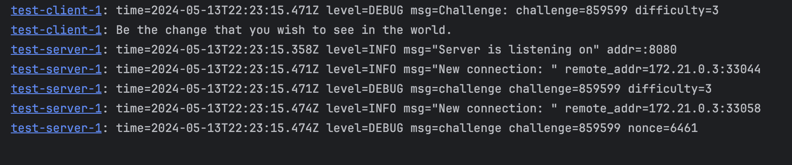

# Word of Wisdom TCP Server
There is simple "Word of Wisdom" TCP server implemented using Go.

The server use a Proof of Work (PoW) algorithm to mitigate the risk of DDoS attacks.  

## Implementation overview

1. Server listen for incoming TCP connections
2. Client connects to the server with the line "GET"
3. Server issues a PoW challenge to the client and closes the connection
4. Client solves the challenge and reconnects to the server with the solution: "\<challenge\> \<nonce\>"
5. Server validates the solution and sends a random quote from a predefined list

## Getting started

```bash
make run
```


